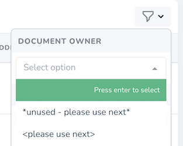
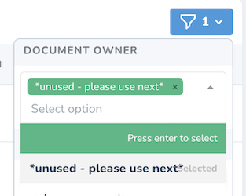

# Legacy Nova Multiselect Filter

Adds capability of choosing multiple values with the Nova Resource filter.




## Installation

Install via composer:

```bash
composer require bupkneb/multiselect-nova-filter
```

## Usage

Use `MultiselectFilter` class instead of `Filter`:

```php
use benk007\Filters\MultiselectFilter;

class DocumentOwner extends MultiselectFilter
{
  public function apply(Request $request, $query, $value)
  {
      return $query->whereIn('user', $value);
  }

  public function options(Request $request)
  {
      return [
          'Herald' => 'herald',
          'Kemar' => 'kemar',
      ];
  }
}
```
